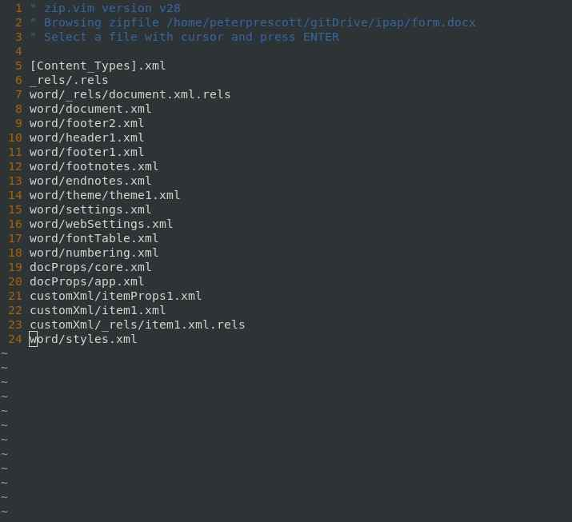
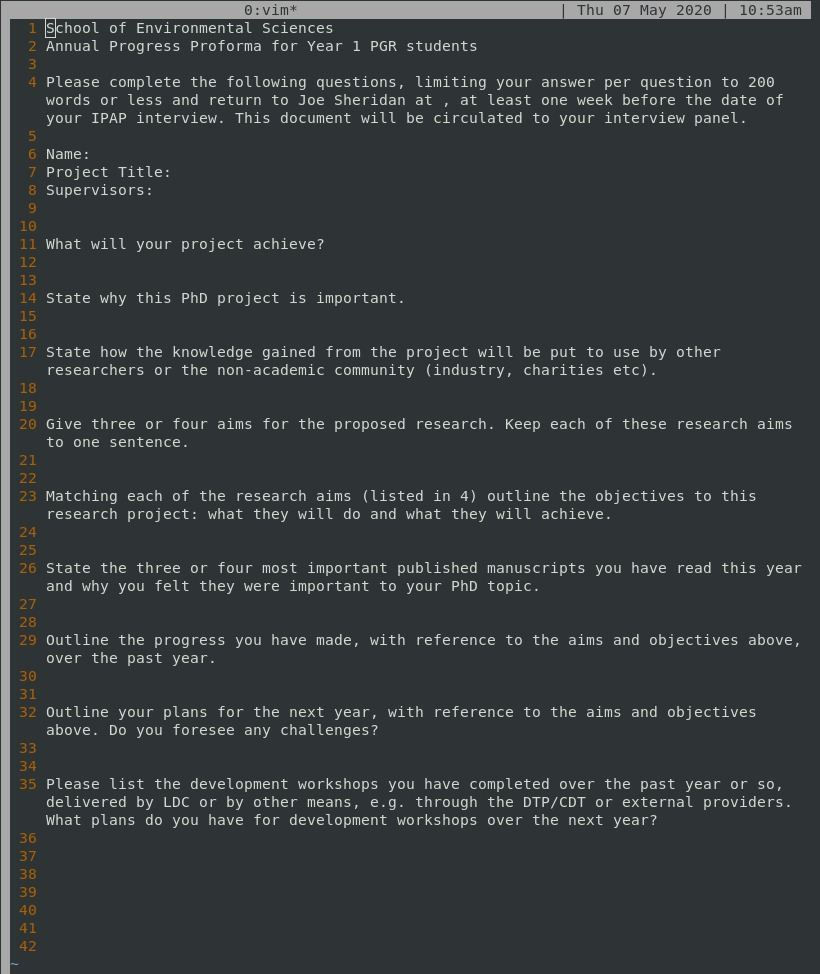

# IPAP Form

The *Independent Progress Assessment Panel* (IPAP) is the 
[Annual Review](https://www.liverpool.ac.uk/student-administration/research-students/progression/independent-progress-assessment-panel/)
for research students at the University of Liverpool.

And I need to fill in a form explaining the importance 
of my research.

But *first things first*, I wrote a Python script to convert
the .docx files they sent us into markdown.

Because there is no need for the zipped set of twenty .xml 
files that make up a .docx file.

